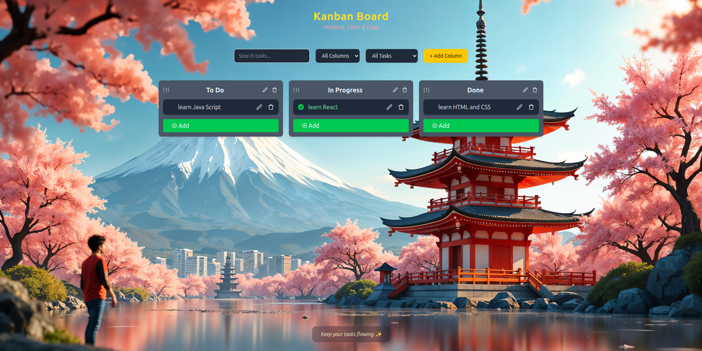

# Kanban Board

A clean, modern **Kanban Board** built with **React + TypeScript**, **Zustand**, **dnd-kit**, and **TailwindCSS**.
Supports creating, editing, dragging tasks & columns — all **persisted locally**.

---

## Live Demo

🔗 **[https://kanban-board-six-tau.vercel.app](https://kanban-board-six-tau.vercel.app)**

---

## ✨ Features

### Core Functionality

- Add / Edit / Delete **Tasks**
- Add / Edit / Delete **Columns**
- **Drag & Drop** using **dnd-kit**:

  - Move tasks within a column
  - Move tasks across columns
  - Reorder columns

- Clean, minimal UI using **TailwindCSS**
- State **automatically saved** using Zustand Persist
- Fully responsive layout

### 🎨 Extra UI Enhancements

- TextInput popup modal
- Separate layout components (Header, Footer, ControlBar)
- Smooth hover & drag interactions

---

##  Project Structure

```
src/
├─ components/
│   ├─ layout/
│   │   ├─ Footer.tsx
│   │   └─ Header.tsx
│   ├─ ControlBar.tsx
│   ├─ ColumnContainer.tsx
│   ├─ KanbanBoard.tsx
│   ├─ TaskCard.tsx
│   └─ TextInputPopup.tsx
├─ store/
│   └─ kanbanStore.ts
├─ utils/
│   ├─ constants.ts
│   ├─ types.ts
├─ App.tsx
├─ main.tsx
```

---

##  Tech Stack

| Tool                | Purpose            |
| ------------------- | ------------------ |
| **React + TS**      | UI + Types         |
| **Zustand**         | Global state       |
| **Zustand Persist** | LocalStorage save  |
| **dnd-kit**         | Drag & Drop engine |
| **Tailwind CSS**    | Styling            |
| **Vite**            | Build tool         |

---

## Installation & Setup

### 1) Clone Repository

```bash
git clone https://github.com/raibikram/kanban-board.git
cd kanban-board
```

### 2) Install Dependencies

```bash
pnpm install
```

_(You may also use `npm install` or `yarn`)_

### 3) Start Development Server

```bash
pnpm dev
```

Now visit:
👉 **[http://localhost:5173](http://localhost:5173)**

---

## How It Works

### Zustand Store (`kanbanStore.ts`)

Manages all application logic:

- Columns & tasks
- Add / Edit / Remove
- Reorder tasks
- Move tasks between columns
- Reorder columns
- Persist state in `localStorage`

### Drag & Drop (dnd-kit)

Used inside:

- `KanbanBoard.tsx`
- `ColumnContainer.tsx`
- `TaskCard.tsx`

Allows:

- Task sorting
- Column sorting
- Column-to-column moving
- Smooth DragOverlay previews

---

## Screenshots



## 👨‍💻 Author

**Bikram Rai**  
Portfolio: https://bikram-rai.com.np  
Email: raibikraminfo@gmail.com
